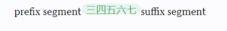

---
{
  "title": "实现一个文本轮播组件",
  "datetime": "2024/10/23",
  "tags": [ "React" ]
}
---

# 实现一个文本轮播组件

一个竖直方向文本轮播的组件, 主要包含以下效果:

- 容器背景色过渡变化
- 容器宽度过渡变化
- 文字平移动画

## 效果



## 组件实现

此处使用 css module 实现

### tsx

```tsx
// CarouselText.tsx

import Styles from './index.module.css'
import { useEffect, useRef } from "react";

type CarouselKeyframe = {
    '--carousel-width': string,
    '--container-bg': string,
    '--body-offset-y': string,
}

const KEYFRAME_QUEUE: CarouselKeyframe[] = [
    {
        '--carousel-width': '50px', '--container-bg': '#E7F0FE',
        '--body-offset-y': '0'
    },
    {
        '--carousel-width': '100px', '--container-bg': '#E7F5EB',
        '--body-offset-y': 'calc(-1 * var(--carousel-height))'
    },
    {
        '--carousel-width': '50px', '--container-bg': '#FBEEE5',
        '--body-offset-y': 'calc(-2 * var(--carousel-height))'
    },
    {
        '--carousel-width': '50px', '--container-bg': '#E7F0FE',
        '--body-offset-y': 'calc(-3 * var(--carousel-height))'
    },
    {
        '--carousel-width': '50px', '--container-bg': '#E7F5EB',
        '--body-offset-y': 'calc(-4 * var(--carousel-height))'
    },
    {
        '--carousel-width': '80px', '--container-bg': '#FAF5D8',
        '--body-offset-y': 'calc(-5 * var(--carousel-height))'
    },
    {
        '--carousel-width': '50px', '--container-bg': '#E7F0FE',
        '--body-offset-y': 'calc(-6 * var(--carousel-height))'
    },
]

const CarouselText = ({ className = '' }: { className?: string }) => {
    const ref = useRef<HTMLDivElement | null>(null)

    useEffect(() => {
        const el = ref.current!

        let animation: Animation | null = null
        let step = 0

        const stepForward = () => {
            const keyframes = KEYFRAME_QUEUE.slice(step, step + 2)
            animation = el.animate(keyframes, {
                // 切换动画持续时间
                duration: 1000,
                // 切换动画结束后停留时间
                endDelay: 1000,
                iterations: 1,
                easing: 'ease',
                fill: 'forwards'
            })
            animation.onfinish = () => {
                step = (step + 1) % 6
                stepForward()
            }
            animation.oncancel = () => {
                animation = null
                console.log('animation cancel')
            }
        }
        stepForward()

        return () => {
            if (animation) animation.cancel()
        }
    }, [])

    return (
        <div ref={ ref } className={ `${ Styles.carouselContainer } ${ className }` }>
            <div className={ Styles.carouselBody }>
                <div className={ Styles.carouselItem } style={ { color: '#1967D2' } }>
                    一二
                </div>
                <div className={ Styles.carouselItem } style={ { color: '#56A56C' } }>
                    三四五六七
                </div>
                <div className={ Styles.carouselItem } style={ { color: '#D17724' } }>
                    八九
                </div>
                <div className={ Styles.carouselItem } style={ { color: '#1967D2' } }>
                    上下
                </div>
                <div className={ Styles.carouselItem } style={ { color: '#56A56C' } }>
                    左右
                </div>
                <div className={ Styles.carouselItem } style={ { color: '#B48B00' } }>
                    前中后
                </div>
                <div className={ Styles.carouselItem } style={ { color: '#1967D2' } }>
                    一二
                </div>
            </div>
        </div>
    )
}
```

### css

```css
/** index.module.css */

@property --carousel-width {
    syntax: '<length>';
    inherits: true;
    initial-value: 50px;
}

@property --container-bg {
    syntax: '<color>';
    inherits: true;
    initial-value: transparent;
}

@property --body-offset-y {
    syntax: '<length>';
    inherits: true;
    initial-value: 0;
}

.carousel-container {
    --carousel-width: 50px;
    --carousel-height: 18px;

    width: var(--carousel-width);
    height: var(--carousel-height);
    border-radius: 999px;
    background-color: var(--container-bg);
    display: inline-block;
    overflow: hidden;

    .carousel-body {
        text-wrap: nowrap;
        transform: translateY(var(--body-offset-y));

        .carousel-item {
            width: 100%;
            height: var(--carousel-height);
            display: flex;
            align-items: center;
            justify-content: center;
        }
    }
}
```

## References

- [index.tsx](https://github.com/badlopo/badlopo.github.io/blob/1308a43f46123be7f61291c05a110a1939ca8ebe/src/pages/dev/index.tsx)
- [index.module.css](https://github.com/badlopo/badlopo.github.io/blob/1308a43f46123be7f61291c05a110a1939ca8ebe/src/pages/dev/index.module.css)
