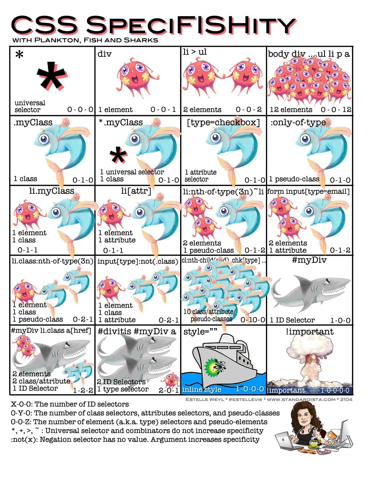

---
{
  "title": "CSS 选择器的优先级叠加",
  "poster": "css-specificity.png",
  "datetime": "2024/10/15",
  "tags": [ "CSS" ]
}
---

# CSS 选择器的权重叠加技巧



## 避免 !important

`!important` 会覆盖所有的样式, 但是会使代码难以维护, 除非必要, 否则不要使用 `!important`.

`.a.b` 的优先级为 `(0, 2, 0)`, 同理, `.a.a` 的优先级也为 `(0, 2, 0)`.
可以使用重复的选择器来提高优先级而避免使用 `!important`.

```html
<!doctype html>
<html lang="en">
    <head>
        <meta charset="UTF-8">
        <meta name="viewport"
              content="width=device-width, user-scalable=no, initial-scale=1.0, maximum-scale=1.0, minimum-scale=1.0">
        <meta http-equiv="X-UA-Compatible" content="ie=edge">
        <title>Document</title>

        <style>
            .box {
                width: 100px;
                height: 100px;
            }

            /* 1 */
            .box.box {
                background-color: red;
            }

            /* 2 */
            .box {
                background-color: blue;
            }
        </style>
    </head>
    <body>
        <div class="box"></div>
    </body>
</html>
```

示例代码中 `2` 在 `1` 之后, 但是 `1` 的优先级更高, 所以背景颜色为红色.

## References

- [MDN -- Cascade, specificity, and inheritance](https://developer.mozilla.org/en-US/docs/Learn/CSS/Building_blocks/Cascade_and_inheritance#specificity)
- [CSS Specifishity](https://specifishity.com/)
