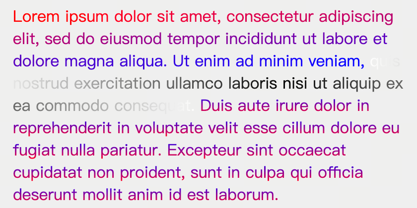
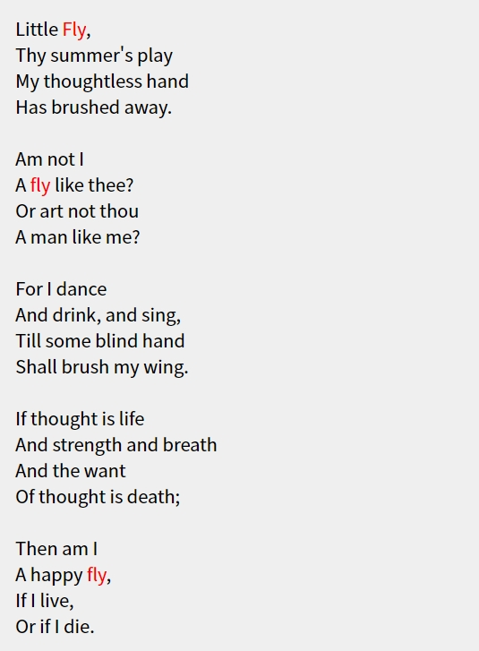

---
{
  "title": "自定义文本高亮的两种实现",
  "datetime": "2024/09/12",
  "tags": [ "CSS", "JavaScript" ]
}
---

# 自定义文本高亮的两种实现

## String.prototype.split 实现

### 原理

使用高亮目标将文本分割为三部分 (pre, target, post), 分别使用不同类名的`span`标签包裹, 通过CSS对三个部分进行样式设置.

### 效果



### 实现

```html
<!doctype html>
<html lang="zh">
    <head>
        <meta charset="UTF-8">
        <meta name="viewport"
              content="width=device-width, user-scalable=no, initial-scale=1.0, maximum-scale=1.0, minimum-scale=1.0">
        <meta http-equiv="X-UA-Compatible" content="ie=edge">
        <title>Example1</title>

        <style>
            #el {
                width: 400px;
                padding: 16px;
                background-color: #EFEFEF;

                .pre-hl {
                    background-clip: text;
                    background-position: 0 0;
                    background-image: linear-gradient(90deg, red, blue);
                    background-repeat: no-repeat;
                    color: transparent;
                    display: inline;
                }

                .hl-target {
                    background-clip: text;
                    background-position: 0 0;
                    background-image: radial-gradient(circle, black, white);
                    background-repeat: no-repeat;
                    color: transparent;
                    display: inline;
                }

                .post-hl {
                    background-clip: text;
                    background-position: 0 0;
                    background-image: linear-gradient(0deg, red, blue);
                    background-repeat: no-repeat;
                    color: transparent;
                    display: inline;
                }
            }
        </style>
    </head>
    <body>
        <p id="el"></p>

        <script>
            const paragraph = 'Lorem ipsum dolor sit amet, consectetur adipiscing elit, sed do eiusmod tempor incididunt ut labore et dolore magna aliqua. Ut enim ad minim veniam, quis nostrud exercitation ullamco laboris nisi ut aliquip ex ea commodo consequat. Duis aute irure dolor in reprehenderit in voluptate velit esse cillum dolore eu fugiat nulla pariatur. Excepteur sint occaecat cupidatat non proident, sunt in culpa qui officia deserunt mollit anim id est laborum.'
            const target = 'quis nostrud exercitation ullamco laboris nisi ut aliquip ex ea commodo consequat.'

            const el = window.el
            el.innerHTML = paragraph

            const [pre, post] = paragraph.split(target)
            el.innerHTML = `<span class="pre-hl">${pre}</span><span class="hl-target">${target}</span><span class="post-hl">${post}</span>`
        </script>
    </body>
</html>
```

## CSS Custom Highlight 实现

### 原理

找到高亮目标在文本中的位置记录为`Range`对象, 使用`Highlight`对象将`Range`对象集合封装, 使用`CSS.highlights.set`方法将
`Highlight`对象绑定到指定的类名上.

### 效果



### 实现

```html
<!doctype html>
<html lang="zh">
    <head>
        <meta charset="UTF-8">
        <meta name="viewport"
              content="width=device-width, user-scalable=no, initial-scale=1.0, maximum-scale=1.0, minimum-scale=1.0">
        <meta http-equiv="X-UA-Compatible" content="ie=edge">
        <title>Example2</title>

        <style>
            ::highlight(hl-target) {
                color: red;
                font-weight: bold;
            }

            #el {
                width: 400px;
                padding: 16px;
                background-color: #EFEFEF;
                white-space: pre-wrap;
            }
        </style>
    </head>
    <body>
        <p id="el"></p>

        <script>
            const paragraph = 'Little Fly,\n' +
                    'Thy summer\'s play\n' +
                    'My thoughtless hand\n' +
                    'Has brushed away.\n' +
                    '\n' +
                    'Am not I\n' +
                    'A fly like thee?\n' +
                    'Or art not thou\n' +
                    'A man like me?\n' +
                    '\n' +
                    'For I dance\n' +
                    'And drink, and sing,\n' +
                    'Till some blind hand\n' +
                    'Shall brush my wing.\n' +
                    '\n' +
                    'If thought is life\n' +
                    'And strength and breath\n' +
                    'And the want\n' +
                    'Of thought is death;\n' +
                    '\n' +
                    'Then am I\n' +
                    'A happy fly,\n' +
                    'If I live,\n' +
                    'Or if I die.'
            const target = 'fly'

            const el = window.el
            el.innerHTML = paragraph
            const textNode = el.firstChild

            const ranges = []
            const matcher = new RegExp(target, 'ig')
            /**
             * @type {RegExpExecArray | null}
             */
            let pos = matcher.exec(paragraph)
            while (!!pos) {
                const range = new Range()
                range.setStart(textNode, pos.index)
                range.setEnd(textNode, pos.index + target.length)
                ranges.push(range)
                pos = matcher.exec(paragraph)
            }

            const hl = new Highlight(...ranges)
            CSS.highlights.set('hl-target', hl)
        </script>
    </body>
</html>
```

## References

- [CSS Custom Highlight API](https://developer.mozilla.org/en-US/docs/Web/API/CSS_Custom_Highlight_API)
- [CSS: highlights static property](https://developer.mozilla.org/en-US/docs/Web/API/CSS/highlights_static)
- [::highlight pseudo-element](https://developer.mozilla.org/en-US/docs/Web/CSS/::highlight)
