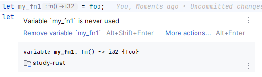
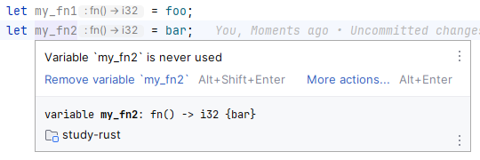

---
{
  "title": "Rust中的各种函数",
  "datetime": "2024/07/02",
  "tags": [ "Rust" ]
}
---

# Rust中的各种函数

在 Rust 中有三种类函数类型: `Function item type`, `Function pointer type`, `Closure type`.

## Function item type

Function item 是 Rust 中最基本的函数类型, 也是最常用的函数类型. 一个 function item 是一个函数定义, 例如:

```rust
fn greet() {
    println!("hi there!");
}
```

当声明一个 `function item` 时，会生成唯一标识其 `function item type` 的**零大小**的值。

此 `function item type` 已经明确标识了该函数的名字、类型参数和声明时绑定的生命周期(区别于调用时传入的生命周期)。所以不再需要一个
**函数指针**指向此函数，在调用时也不需要**动态派发**。

```rust
use core::any::type_name;

fn get_typename_of<T>(_: &T) -> &'static str {
    type_name::<T>()
}

fn foo() -> i32 {
    42
}

fn bar() -> i32 {
    35
}

#[test]
fn function_item_typename() {
    // 1. 零大小
    println!("size of foo is: {}", core::mem::size_of_val(&foo));
    // => size of foo is: 0

    println!("size of bar is: {}", core::mem::size_of_val(&bar));
    // => size of bar is: 0

    println!("size of function with generic type 1: {}", core::mem::size_of_val(&get_typename_of::<i32>));
    // => size of function with generic type 1: 0

    println!("size of function with generic type 2: {}", core::mem::size_of_val(&get_typename_of::<u32>));
    // => size of function with generic type 2: 0

    // 2. 类型
    println!("type of foo is: \"{}\"", get_typename_of(&foo));
    // => type of foo is: "study_rust::function_like::foo"

    println!("type of bar is: \"{}\"", get_typename_of(&bar));
    // => type of bar is: "study_rust::function_like::bar"
}
```

没有直接引用 `function item type` 的语法，但编译器会在错误消息中将类型显示为类似 `fn() -> i32 {fn_name}`
形式的内容。某些编辑器也会显示此类型。

- 函数 foo 的类型提示
  
- 函数 bar 的类型提示
  

## Function pointer type

`Function pointer type` 是一个指向函数的指针，它的类型在编译时**不需要**明确已知。可以通过从**function item**或**非捕获闭包
**强制转换而来。

在**显式指定**(function_pointer_test.1)或**模式匹配**(function_pointer_test.4)中，会发生`function item type`到
`function pointer type`的转换。

```rust
type MyFunctionPointer = fn();

fn hi() {
    println!("hi");
}

fn hello() {
    println!("hello");
}

#[test]
fn function_pointer_test() {
    // 1. coercion from function item
    let mut greet: MyFunctionPointer = hi;
    greet();
    // => hi
    println!("size of greet is: {}", core::mem::size_of_val(&greet));
    // => size of greet is: 8

    // 2. re-assign is ok
    greet = hello;
    greet();
    // => hello
    println!("size of greet is: {}", core::mem::size_of_val(&greet));
    // => size of greet is: 8

    // 3. coercion from non-capturing closure
    greet = || println!("nice day, isn't it?");
    greet();
    // => nice day, isn't it?
    println!("size of greet is: {}", core::mem::size_of_val(&greet));
    // => size of greet is: 8

    // 4. coercion in pattern matching
    let condition = true;
    let my_size_of = if condition {
        core::mem::size_of::<i32>
    } else {
        core::mem::size_of::<u32>
    };
    println!("size of core::mem::size_of::<i32> is: {}", core::mem::size_of_val(&core::mem::size_of::<i32>));
    println!("size of core::mem::size_of::<u32> is: {}", core::mem::size_of_val(&core::mem::size_of::<u32>));
    println!("size of my_size_of is: {}", core::mem::size_of_val(&my_size_of));
    // => size of core::mem::size_of::<i32> is: 0
    // => size of core::mem::size_of::<u32> is: 0
    // => size of my_size_of is: 8

    // EXTRA: size of usize
    println!("size of 'usize' is: {}", core::mem::size_of::<usize>());
    // => size of 'usize' is: 8
}
```

## Closure type

闭包使用[闭包表达式](https://doc.rust-lang.org/reference/expressions/closure-expr.html)创建，具有唯一的、匿名的类型。

一个闭包大致相对于包含所有捕获项的一个结构体(其中各字段类型与捕获形式匹配)，其大小与该结构体的大小相同。

```rust
struct Alternative1 {}

/// alternative to capturing closure -- 1 argument
#[allow(unused)]
struct Alternative2 {
    arg1: String,
}

/// alternative to capturing closure -- 2 argument (1)
#[allow(unused)]
struct Alternative3 {
    arg1: String,
    arg2: u32,
}

/// alternative to capturing closure -- 2 argument (2)
#[allow(unused)]
struct Alternative4<'a> {
    arg1: &'a String,
    arg2: u32,
}

#[test]
fn closure_test() {
    // 1. non-capturing closure
    let closure1 = || println!("no args");
    let alt1 = Alternative1 {};
    println!("closure: {}; struct: {}; (): {}", size_of_val(&closure1), size_of_val(&alt1), size_of::<()>());
    // => closure: 0; struct: 0; (): 0

    // 2. capturing closure (1)
    let arg1 = "abc".to_string();
    let closure2 = || {
        // consume arg1 to ensure it's captured
        let _args = arg1;
        println!("args: {:?}", _args);
    };
    let alt2 = Alternative2 { arg1: "abc".to_string() };
    println!("closure: {}; struct: {}; String: {}", size_of_val(&closure2), size_of_val(&alt2), size_of::<String>());
    // => closure: 24; struct: 24; String: 24

    // 3. capturing closure (2)
    let arg1 = "abc".to_string();
    let arg2 = 123_u32;
    let closure3 = || {
        let _args = (arg1, arg2);
        println!("args: {:?}", _args);
    };
    let alt3 = Alternative3 { arg1: "abc".to_string(), arg2: 123_u32 };
    println!("closure: {}; struct: {}; String: {}; u32: {}", size_of_val(&closure3), size_of_val(&alt3), size_of::<String>(), size_of::<u32>());
    // => closure: 32; struct: 32; String: 24; u32: 4

    // 4. capturing closure (3)
    let arg1 = "abc".to_string();
    let arg2 = 123_u32;
    let closure4 = || {
        let _args = (&arg1, arg2);
        println!("args: {:?}", _args);
    };
    let alt4 = Alternative4 { arg1: &arg1, arg2: 123_u32 };
    println!("closure: {}; struct: {}; &String: {}; u32: {}", size_of_val(&closure4), size_of_val(&alt4), size_of::<&String>(), size_of::<u32>());
    // closure: 16; struct: 16; &String: 8; u32: 4
}
```

### 捕获模式 & move

默认情况下闭包会自动推断如何捕获变量(按如下优先级):

- 不可变借用
- 唯一不可变借用
- 可变借用
- 移动

关键字`move`的作用是将所引用的变量的**所有权转移**至闭包内(根据变量的语义使用 `Copy` 或 `Move`)
，通常用于使闭包的生命周期大于所捕获的变量的原生命周期(例如将闭包返回或移至其他线程)。

如果闭包捕获的所有变量都使用 `Copy` 语义，则闭包自身也实现 `Copy` (类似 `struct` 的 `Copy` 自动实现)。

> 注意:
>
> - 捕获模式指闭包如何将捕获的变量保存在匿名结构体中，与后续如何使用无关
> - 关键字 `move` 仅影响闭包如何捕获变量，对闭包实现 `Fn*` 中的哪一个 trait 没有影响

## Fn & FnMut & FnOnce

在 Rust 中, `()` 是一个**操作符**，它和 `+`、`-`、`*`、`/` 等操作符一样可以被**重载**。 Rust 中的操作符重载是通过实现其对应的
`trait` 来实现的，`()` 对应的 `trait` 是 `Fn`、`FnMut` 和 `FnOnce`。 实现了 `Fn`、`FnMut`、`FnOnce` 任一 `trait`
的类型，都是可调用的，可以像使用函数一样通过 `variable_name()` 的形式进行调用。

### Fn (std::ops::Fn)

- 使用**不可变**接收者的**调用**的表示
- 可被多次调用
- 如果 `T: Fn`，那么 `&T` 会自动实现 `Fn`

```rust
pub trait Fn<Args>: FnMut<Args>
where
    Args: Tuple,
{
    // Required method
    extern "rust-call" fn call(&self, args: Args) -> Self::Output;
}
```

### FnMut (std::ops::FnMut)

- 使用**可变**接收者的**调用**的表示
- 可被多次调用，并且可以修改 `self` 的状态
- 如果 `T: FnMut`，那么 `&mut T` 会自动实现 `FnMut`

```rust
pub trait FnMut<Args>: FnOnce<Args>
where
    Args: Tuple,
{
    // Required method
    extern "rust-call" fn call_mut(
        &mut self,
        args: Args
    ) -> Self::Output;
}
```

### FnOnce (std::ops::FnOnce)

- 使用**所有权**接收者的**调用**的表示
- 只能被调用一次

```rust
pub trait FnOnce<Args>
where
    Args: Tuple,
{
    type Output;

    // Required method
    extern "rust-call" fn call_once(self, args: Args) -> Self::Output;
}
```

### feature: fn_traits 和 unboxed_closures

- `fn_traits` 允许为自定义类型实现 `Fn*` trait, 从而使其可调用
- `unboxed_closures` 允许使用 'rust-call' ABI 来编写函数 (实现 `Fn*` 时必需)

```rust
#![feature(unboxed_closures)]

// 标记 `add_args` 函数使用 'rust-call' ABI
extern "rust-call" fn add_args(args: (u32, u32)) -> u32 {
    args.0 + args.1
}

fn main() {}
```

### 关系

- `Fn: FnMut: FnOnce`
- 如果一个变量需要 `FnOnce`，那么它可以接受 `FnMut` 或 `Fn`。(因为 `FnMut` 和 `Fn` 都是 `FnOnce` 的子集)
- 如果一个变量需要 `FnMut`，那么它可以接受 `Fn`。(因为 `Fn` 是 `FnMut` 的子集)

### 示例

#### 使用

```rust
#[test]
fn fn_test() {
    fn caller<F>(f: F) where F: Fn(u32) {
        // first call
        f(1);

        // second call
        f(2);
    }

    let var = 1;
    let my_fn = |num| println!("{}: captured var is: {}", num, var);

    caller(my_fn);
    // => 1: captured var is: 1
    // => 2: captured var is: 1
}

#[test]
fn fn_mut_test() {
    fn caller<F>(mut f: F) where F: FnMut(u32) {
        // first call
        f(1);

        // second call
        f(2);
    }

    let mut var = 1;
    let my_mut_fn = |num| {
        var += 1;
        println!("{}: captured var is: {}", num, var)
    };

    caller(my_mut_fn);
    // => 1: captured var is: 2
    // => 2: captured var is: 3
}

#[test]
fn fn_once_test() {
    fn caller<F>(f: F) where F: FnOnce(u32) {
        // first call
        f(1);
        // => 1: captured var is: 1

        // second call -- won't compile cause f can only be called once
        // f(2);
    }

    let var = 1;
    let my_once_fn = |num| println!("{}: captured var is: {}", num, var);

    caller(my_once_fn);
}
```

#### 类型兼容

```rust
#[test]
fn type_test() {
    fn need_fn(f: impl Fn()) {
        f();
    }
    fn need_fn_mut(mut f: impl FnMut()) {
        f();
    }
    fn need_fn_once(f: impl FnOnce()) {
        f();
    }

    let my_fn = || println!("hello");

    let mut var = 1;
    let mut my_mut_fn = || {
        var += 1;
        println!("captured var is: {}", var)
    };

    // 1. MATCH: expect Fn, got Fn
    need_fn(my_fn);
    // => hello

    // 2. MATCH: expect FnMut, got FnMut
    need_fn_mut(&mut my_mut_fn);
    // => captured var is: 2

    // 3. MISMATCH: expect FnOnce, got Fn
    need_fn_once(my_fn);
    // => hello

    // 4. MISMATCH: expect FnOnce, got FnMut
    need_fn_once(&mut my_mut_fn);
    // => captured var is: 3

    // 5. MISMATCH: expect FnMut, got Fn
    need_fn_mut(my_fn);
    // => hello
}
```

#### 自定义实现

[在 Playground 中查看](https://play.rust-lang.org/?version=nightly&mode=debug&edition=2021&gist=43dd609f7f3a4492d077c2707d82aec8)

```rust
#![feature(unboxed_closures)]
#![feature(fn_traits)]

struct MyCallableStruct {}

impl FnOnce<()> for MyCallableStruct {
    type Output = String;

    extern "rust-call" fn call_once(self, _args: ()) -> String {
        // 在这里定义调用结构体时的行为
        format!("call with no args")
    }
}

fn main() {
    let callable = MyCallableStruct {};
    let result = callable();
    println!("result is: {}", result);
    // => result is: call with no args
}
```

> 注意:
>
> - 当前仅 `nightly` 版本支持自定义实现 `Fn`、`FnMut` 和 `FnOnce`
> - 需要添加 `#![feature(fn_traits)]` 和 `#![feature(unboxed_closures)]` 标志

## References

- [Function item types](https://doc.rust-lang.org/reference/types/function-item.html)
- [Function pointer types](https://doc.rust-lang.org/reference/types/function-pointer.html)
- [Closure types](https://doc.rust-lang.org/reference/types/closure.html)
- [Fn](https://doc.rust-lang.org/std/ops/trait.Fn.html)
- [FnMut](https://doc.rust-lang.org/std/ops/trait.FnMut.html)
- [FnOnce](https://doc.rust-lang.org/std/ops/trait.FnOnce.html)
- [Closure expr](https://doc.rust-lang.org/reference/expressions/closure-expr.html)
- [Closure -- Capture modes](https://doc.rust-lang.org/reference/types/closure.html#capture-modes)
- [fn_traits](https://doc.rust-lang.org/beta/unstable-book/library-features/fn-traits.html)
- [unboxed_closures](https://doc.rust-lang.org/beta/unstable-book/language-features/unboxed-closures.html)
- [Implement unique types per fn item, rather than having all fn items have fn pointer type](https://github.com/rust-lang/rust/pull/19891)
