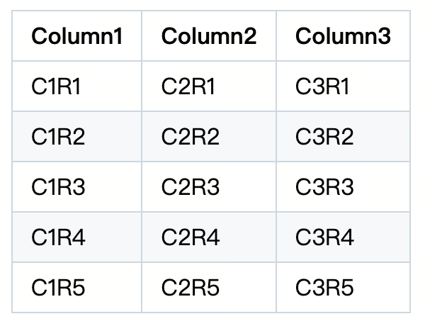

---
{
  "title": "GitHub 风格的表格样式",
  "datetime": "2024/08/29",
  "tags": [ "CSS" ]
}
---

# GitHub 风格的表格样式

## 效果



## CSS

```css
table {
    border-color: #808080;
    border-spacing: 0;
    border-collapse: collapse;

    tr {
        border-top: solid 1px #d0d7deb3;
        background-color: white;

        &:nth-child(2n) {
            background-color: #f6f8fa;
        }
    }

    th {
        font-weight: 600;
    }

    th, td {
        padding: 6px 13px;
        border: solid 1px #d0d7de;
    }
}
```
