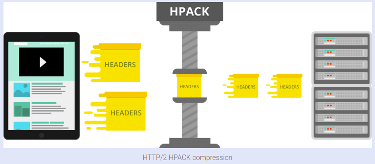

---
{
  "title": "Http Protocol",
  "datetime": "2023/12/14",
  "tags": [ "RFC" ]
}
---

# Http Protocol

**HTTP** is an **application-level** protocol for distributed, collaborative, hypermedia information systems, while *
*TCP** solves the logic of the **transport layer**. The reason why **HTTP** uses **TCP** instead of **UDP** is that (
open) a web page must transfer a lot of data, and the **TCP** protocol provides transmission control, organizes data in
order, and error correction.

The **HTTP**connection uses the "**request-response**" method, which not only needs to establish a connection when
requesting, but also the server can only reply to the data after the client sends a request to the server.

**HTTP/1.0** is the first HTTP protocol version to specify the version number in the communication, and it is still
widely used, especially in proxy servers.

Persistent connections are used **by default** in **HTTP/1.1**, and it can work well with proxy servers. It also
supports sending multiple requests at the same time in pipeline mode to reduce line load and improve transmission speed.

**HTTP/2.0** greatly improves web performance on the basis of **HTTP/1.x** and reduces network latency. **HTTP/1.0** and
**1.1** will coexist for a long time in the future, which is determined by the slow update of network infrastructure.

## HTTP/0.9

The initial version of HTTP had no version number (it was later called **0.9** to differentiate it from later versions)

**HTTP/0.9** was extremely simple:

- Requests consisted of a single line and started with the **only** possible method `GET` followed by the path to the
  resource.
- The full URL wasn't included as the protocol, server, and port weren't necessary once connected to the server.

```request
GET /example.html
```

And the server will close the **TCP connection** once it has sent the response.

``` html
<html>
  example page content
</html>
```

## HTTP/1.0

> **HTTP/1.0** is not a standard. It is just a reference document that records existing practices and patterns. It has
> no actual binding force.

With the development of the Internet, the original HTTP (**HTTP/0.9**) can no longer meet user needs.

**HTTP/1.0** was launched in **1996** (Between 1991-1995, these were introduced with a try-and-see approach. an
informational document that described the common practices was published in **1996**. This was known as **RFC 1945** and
defined **HTTP/1.0**)

- **Versioning information** was sent within each request (**HTTP/1.0** was appended to the `GET` line).
- A **status code line** was also sent at the beginning of a **response**. This allowed the browser itself to recognize
  the success or failure of a request and adapt its behavior accordingly. For example, updating or using its local cache
  in a specific way.
- The concept of HTTP `headers` was introduced for both requests and responses. Metadata could be transmitted and the
  protocol became extremely flexible and extensible.
- Documents **other than plain HTML files** could be transmitted thanks to the `Content-Type` header.

### Example 1. Plain Text

- Request

```http
GET /mypage.html HTTP/1.0
User-Agent: NCSA_Mosaic/2.0 (Windows 3.1)
```

- Response

```http
200 OK
Date: Tue, 15 Nov 1994 08:12:31 GMT
Server: CERN/3.0 libwww/2.17
Content-Type: text/html
<HTML>
  A page with an image
  
</HTML>
```

### Example 2. Image

- Request

```http
GET /myimage.gif HTTP/1.0
User-Agent: NCSA_Mosaic/2.0 (Windows 3.1)
```

- Response

```http
200 OK
Date: Tue, 15 Nov 1994 08:12:32 GMT
Server: CERN/3.0 libwww/2.17
Content-Type: text/gif
(image content)
```

## HTTP/1.1

> The first standardized version of HTTP, **HTTP/1.1**, was published in early **1997**, only a few months after *
*HTTP/1.0**.

- New methods were added (`PUT`, `DELETE`, `TRACE`, `OPTIONS`, `CONNECT`, etc.)
- A **TCP connection** could be reused, which saved time. It no longer needed to be opened multiple times to display the
  resources embedded in the single original document. (By specifying the `Connection: keep-alive` header)
- **Pipelining** was added. This allowed a second request to be sent **before** the answer to the first one was fully
  transmitted. This lowered the latency of the communication.
- Chunked responses were also supported, largely improving the way large files were sent.
- Additional cache control mechanisms were introduced (such as `Cache-Control`, `ETag`, `If-Modified-Since`,
  `If-Unmodified-Since`, `If-Match`, `If-None-Match`, etc.)
- Thanks to the `Host` header, the ability to host different domains from the same IP address allowed server
  collocation. (The `Host` header is required in **HTTP/1.1**)

## HTTP/2.0

Google implemented an experimental protocol SPDY in the **early 2010s**. `SPDY` defined an increase in responsiveness
and solved the problem of duplicate data transmission, serving as the **foundation** for the **HTTP/2** protocol.

The **HTTP/2** protocol differs from **HTTP/1.1** in a few ways:

- It's a **binary** protocol rather than a text protocol. It transfers binary instead of plain text.
- It's a **multiplexed protocol**. Parallel requests can be made over the **same tcp connection**, removing the
  constraints of the **HTTP/1.x** protocol.
- It compresses headers using the **HPACK compression algorithm**. As these are often similar among a set of requests,
  this removes the duplication and overhead of data transmitted.
- It allows a server to populate data in a **client cache** through a mechanism called the **server push**.

### Server Push

Imagine that the guest (Client) asks (sends request) waiter (Server) for a meal, then the waiter gets the meal from the
restaurant chef (your application logic), but the waiter also thinks you would need a bottle of water, so he brings that
too **with** your meal. The end result of this would be only **one** TCP connection and only **one** request that will
significantly lower the server load.

## HTTP/3.0

Google invented the **QUIC**(Quick UDP Internet Connections) protocol based on **UDP**.

**QUIC** is designed to provide much lower latency for HTTP connections. Like **HTTP/2**, it is a multiplexed protocol,
but **HTTP/2** runs over a **single** TCP connection, so packet loss detection and retransmission handled at the TCP
layer can block **all** streams. **QUIC** runs multiple streams over UDP and implements packet loss detection and
retransmission **independently** for each stream, so that if an error occurs, only the stream with data in that packet
is blocked.

- UDP is `unordered`, so there is no head-of-line blocking problem
- **QUIC** has its own protocol for packet loss retransmission and congestion control
- The HTTPS handshake usually requires **six** network interactions. **QUIC** merges TLS and TCP into a **three-way**
  handshake.

In **June 2022**, **HTTP/3.0** was finally standardized as **rfc9114**

## Diagram

### Request Multiplexing


### Header Compression



### Binary Protocol


### Server Push


### Simple Comparison

| Protocol                | Number of requests | Load time | Initiator                                                                                                                                                 | 
|-------------------------|--------------------|-----------|-----------------------------------------------------------------------------------------------------------------------------------------------------------|
| Http/1.1                | 102                | 12.97s    | Initiator of the first one is user/client and the rest of the requests are initiated by the response to client who realizes he needs some other resources |
| Http/2                  | 102                | 11.19s    | Initiator of the first one is user/client and the rest of the requests are initiated by the response to client who realizes he needs some other resources |
| Http/2 with Server Push | 102                | 3.17s     | Initiator of the first one is user/client and the rest of requests are initiated by the push of the server (virtually one request/response cycle).        |

- Http/1.1: 102 requests, 12.97s load time

We can see how requests are made through multiple batches (TCP connections).


- Http/2: 102 requests, 11.19s load time

We can see how requests are made through 2 batches (TCP connections). Take note of the load time. In this case, it is a
bit lower than the load time of HTTP/1.1 example (but it doesn't have to be always). This example shows the multiplexing
of client requests.


- Http/2 with Server Push: 102 requests, 3.17s load time

We can see how requests are made through 1 batch (1 TCP connection).


- Animation demonstration


## References

- [rfc1945: Hypertext Transfer Protocol -- HTTP/1.0](https://www.rfc-editor.org/rfc/rfc1945)
- [rfc2616: Hypertext Transfer Protocol -- HTTP/1.1](https://www.rfc-editor.org/rfc/rfc2616)
- [rfc7230: Hypertext Transfer Protocol (HTTP/1.1): Message Syntax and Routing](https://www.rfc-editor.org/rfc/rfc7230)
- [rfc7231: Hypertext Transfer Protocol (HTTP/1.1): Semantics and Content](https://www.rfc-editor.org/rfc/rfc7231)
- [rfc7232: Hypertext Transfer Protocol (HTTP/1.1): Conditional Requests](https://www.rfc-editor.org/rfc/rfc7232)
- [rfc7233: Hypertext Transfer Protocol (HTTP/1.1): Range Requests](https://www.rfc-editor.org/rfc/rfc7233)
- [rfc7234: Hypertext Transfer Protocol (HTTP/1.1): Caching](https://www.rfc-editor.org/rfc/rfc7234)
- [rfc7235: Hypertext Transfer Protocol (HTTP/1.1): Authentication](https://www.rfc-editor.org/rfc/rfc7235)
- [rfc7540: Hypertext Transfer Protocol Version 2 (HTTP/2)](https://www.rfc-editor.org/rfc/rfc7540)
- [rfc9114: HTTP/3](https://www.rfc-editor.org/rfc/rfc9114)
- [Evolution of HTTP | MDN](https://developer.mozilla.org/en-US/docs/web/http/basics_of_http/evolution_of_http)
