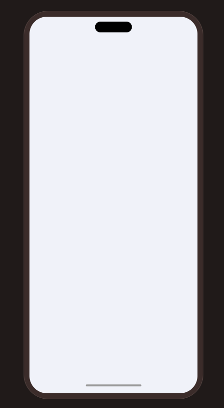

---
{
  "title": "手机外观样式",
  "datetime": "2024/11/05",
  "tags": [ "CSS" ]
}
---

# 手机外观样式

可以用于展示移动端网页的样式。

## 效果



## 实现

- `phone-shell` 手机外壳
- `phone-vp` 手机视口
- `phone-content` 手机内容 (可以替换为iframe元素)

```html
<!doctype html>
<html lang="zh">
    <head>
        <meta charset="UTF-8">
        <meta name="viewport"
              content="width=device-width, user-scalable=no, initial-scale=1.0, maximum-scale=1.0, minimum-scale=1.0">
        <meta http-equiv="X-UA-Compatible" content="ie=edge">
        <title>phone</title>

        <style>
            html, body {
                margin: 0;
                padding: 0;
                width: 100%;
                height: 100%;
                background-color: #201a19;
            }

            body {
                min-width: 422px;
                min-height: 876px;
                display: flex;
                flex-direction: column;
                align-items: center;
                justify-content: center;
            }

            .phone-shell {
                /* shell */
                position: relative;
                width: 390px;
                height: 844px;
                padding: 12px;
                border: 1px solid #534340;
                border-radius: 54px;
                background: #3b2c2a;
                flex-shrink: 0;
                box-sizing: border-box;

                &::before {
                    content: '';
                    position: absolute;
                    z-index: 10;
                    top: 22px;
                    left: 50%;
                    width: 80px;
                    height: 24px;
                    border-radius: 999px;
                    background: #000;
                    pointer-events: none;
                    transform: translateX(-50%);
                }

                &::after {
                    content: '';
                    position: absolute;
                    z-index: 100;
                    left: 50%;
                    bottom: 27px;
                    width: 120px;
                    height: 4px;
                    border-radius: 999px;
                    background: #999;
                    transform: translateX(-50%);
                }

                .phone-vp {
                    /* viewport */
                    width: 100%;
                    height: 100%;
                    border-radius: 38px;
                    background-color: #ffffff;
                    overflow: hidden;
                }
            }

            .phone-content {
                /* your content */
                width: 100%;
                height: 100%;
                background-color: #f0f2f9;
            }
        </style>
    </head>
    <body>
        <div class="phone-shell">
            <div class="phone-vp">
                <div class="phone-content"></div>
            </div>
        </div>
    </body>
</html>
```
