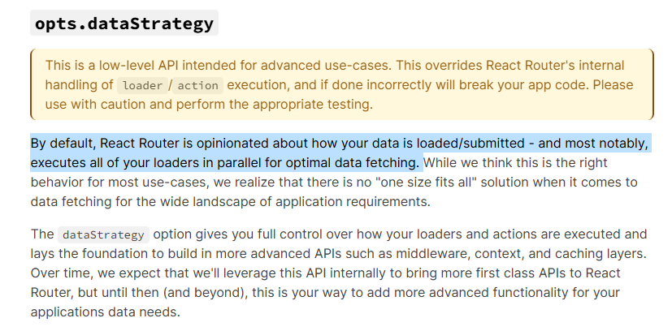

---
{
  "title": "React Router 的 loader 执行顺序",
  "datetime": "2024/11/10",
  "tags": [ "React" ]
}
---

# React Router 的 loader 执行顺序

> 关于 `dataStrategy` 参数:
> - react-router\@6.23.0 引入 (`unstable_dataStrategy`)
> - react-router\@6.27.0 稳定 (`dataStrategy`)

---

在使用 react-router 时, 通常会在最外层使用一层布局路由并在其 `loader` 中进行一些全局的初始化和路由跳转逻辑. 在内部页面的
`loader` 中获取数据并渲染页面.

默认情况下, react-router 中的 `loader` 是并发执行的, 但是在某些情况下需要控制嵌套路由的 `loader` 的执行顺序,
以确保调用逻辑的正确性.



## 示例

> 此处仅作最小化呈现, 展示为代码片段, 完整可运行示例查看 gist

- 在布局路由中获取在前端存储的 `refresh token` 并用其刷新 `access token`, 并在刷新失败时自动跳转到登录页.
- 在功能页中调用后端接口获取数据并渲染页面.

### 状态管理

```ts
// user.ts

// global user state management
abstract class User {
    static token: string | null = 'expired token'

    static async refreshToken(): Promise<boolean> {
        await new Promise((resolve) => setTimeout(resolve, 1000))

        const random = Math.random()

        // success to refresh token
        if (random > 0.5) {
            User.token = 'new token'
            return true
        }

        // failed to refresh token (the refresh token is expired)
        return false
    }

    static async functionCall() {
        console.log('functionCall with token', User.token)

        return { result: 'success' }
    }
}
```

### 布局路由

```tsx
// root-layout.tsx

const RootLayout = () => <Outlet/>

// refresh access token before rendering the page,
// or redirect to the auth page if the refresh token is expired
RootLayout.loader = async () => {
    const isRefreshed = await User.refreshToken()
    console.log('isRefreshed', isRefreshed)

    // if the refresh token is expired, redirect to the auth page
    if (!isRefreshed) return replace('/auth')

    // otherwise, keep the current page
    return null
}
```

### 功能页

```tsx
// function-page.tsx

// specific function page
const FunctionPage = () => {
    return (
        <div>
            <h1>User Page</h1>
            <p>name: { User.name }</p>
        </div>
    )
}

// load some data before rendering the page
FunctionPage.loader = () => User.functionCall()
```

### 路由和渲染

```tsx
// main.tsx

const router = createHashRouter([
    {
        element: <RootLayout/>,
        loader: RootLayout.loader,
        children: [
            {
                path: '/auth',
                element: <div>Auth Page</div>
            },
            {
                path: '/function-call',
                loader: FunctionPage.loader,
                element: <FunctionPage/>
            }
        ],
    }
])

// entry point
createRoot(document.getElementById('root')!)
    .render(<RouterProvider router={ router }/>)
```

### 结果

RootLayout:

- `isRefreshed false` 并重定向到 `/auth`
- `isRefreshed true` 并继续渲染页面

FunctionPage:

`functionCall with token expired token`

由于 `react-router` 中默认所有的 `loader` 是并发的, 所以 `FunctionPage.loader` 中会直接使用旧的token进行请求, 这和我们的预期不符.

## 自定义嵌套路由的 loader 执行顺序

自定义 `dataStrategy` 函数, 以确保嵌套路由的 `loader` 按照指定的顺序执行.

- 提取出所有需要执行的 `loader`
- 按照顺序执行 `loader` 并保存执行结果
- 返回执行结果集作为 `dataStrategy` 的结果

```ts
const dataStrategy: DataStrategyFunction = async ({ matches }) => {
    // filter the matches that have loader
    const matchesWithLoader = matches.filter(m => m.shouldLoad)

    const results: { [k: string]: DataStrategyResult } = {}

    // ensure all loaders are executed in order
    for (const match of matchesWithLoader) {
        try {
            results[match.route.id] = await match.resolve()
        } catch (err) {
            results[match.route.id] = { type: 'error', result: err }
        }
    }

    return results
}
```

### 结果

`RootLayout.loader` 总是能先执行完毕, 然后再执行 `FunctionPage.loader`

## References

- [React-Router -- layout routes](https://reactrouter.com/en/main/route/route#layout-routes)
- [React-Router -- dataStrategy](https://reactrouter.com/en/main/routers/create-browser-router#optsdatastrategy)
- [React-Router -- CHANGELOG v6.27.0](https://github.com/remix-run/react-router/blob/main/CHANGELOG.md#v6270)
- [React-Router -- Stabilize unstable_dataStrategy](https://github.com/remix-run/react-router/pull/11974)
- [GitHub Gist -- react-router-data-strategy.tsx](https://gist.github.com/lopo12123/2ab8625df85999235252fa75fd34c61f)
