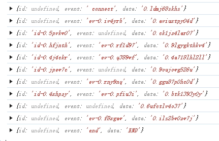

---
{
  "title": "SSE 响应解析 (JavaScript)",
  "datetime": "2024/11/01",
  "tags": [ "JavaScript" ]
}
---

# SSE 响应解析 (JavaScript)

简单地记录了一下对SSE响应的解析实现

> 以下为此方案的一些局限性, 根据实际情况进行调整:

- 忽略了 `retry` 字段
- 忽略了注释行 (以 `:` 开头)
- 约定了 `data` 字段必定存在

## SSEStreamParser 实现

```ts
// SSEStreamParser.ts

/**
 * 一段 sse 消息对应的数据结构
 */
type SSESegment = {
    /**
     * sse id, not guaranteed to be unique
     */
    id?: string
    /**
     * sse event name, customized
     */
    event?: string
    /**
     * sse data, decoded into string
     */
    data: string
}

type ChunkReceiveCallback = (chunk: SSESegment) => void

/**
 * 解析一段完整的 sse 消息, 得到 SSESegment 对象
 */
const parse_segment = (raw: string): SSESegment => {
    const idStart = raw.indexOf('id:')
    const eventStart = raw.indexOf('event:', idStart)
    const dataStart = raw.indexOf('data:', eventStart)

    return {
        id: idStart === -1 ? undefined : raw.slice(idStart + 3, (eventStart === -1 ? dataStart : eventStart) - 1),
        event: eventStart === -1 ? undefined : raw.slice(eventStart + 6, dataStart - 1),
        data: raw.slice(dataStart + 5),
    }
}

/**
 * 解析一次 read 的结果(Uint8Array 对应的字符串), 得到 SSESegment 对象列表 和 buffer 字符串
 *
 * - 使用 '\n\n' 分割, 每一段认为是一个完整的 sse 消息 (最后一段作为 buffer 返回)
 * - 对每一段进行解析, 解析出 id, event, data 三个字段, 得到 SSESegment 对象
 * - 分别返回解析出的 SSESegment 对象列表和 buffer 字符串
 */
const parse_chunks = (raw: string): { segments: SSESegment[], buffer: string } => {
    const chunks = raw.split('\n\n')

    const segments: SSESegment[] = []
    for (let i = 0 ; i < chunks.length - 1 ; i += 1) {
        segments.push(parse_segment(chunks[i]))
    }

    return { segments, buffer: chunks[chunks.length - 1] }
}

class SSEStreamParser {
    /**
     * a TextDecoder instance, decode Uint8Array to string
     */
    readonly #decoder: TextDecoder

    /**
     * a ReadableStreamDefaultReader instance, read Uint8Array from a ReadableStream
     */
    readonly #reader: ReadableStreamDefaultReader<Uint8Array>

    /**
     * a list of segments, each segment is a complete sse message
     */
    #segments: SSESegment[] = []

    public get segments() {
        return this.#segments
    }

    #parsed: boolean = false

    public get parsed() {
        return this.#parsed
    }

    constructor(reader: ReadableStreamDefaultReader<Uint8Array>) {
        this.#decoder = new TextDecoder('utf-8')
        this.#reader = reader
    }

    /**
     * @param onChunk a callback function, called when a complete segment is decoded. (call this first, then update segments)
     */
    async parse(onChunk: ChunkReceiveCallback) {
        if (this.#parsed) throw new Error('already parsed, use #segments instead')
        this.#parsed = true

        let _buffer: string = ''
        let result = await this.#reader.read()
        while (!result.done) {
            // decode Uint8Array to string
            const raw = this.#decoder.decode(result.value)

            // parse string into segments and buffer
            const { segments, buffer } = parse_chunks(_buffer + raw)

            // update buffer
            _buffer = buffer

            // call onChunk callback and update segments
            for (const segment of segments) {
                onChunk(segment)
                this.#segments.push(segment)
            }

            // read next part of the stream
            result = await this.#reader.read()
        }
    }
}

export {
    SSEStreamParser,
}
```

## Server 端的简单实现

> 仅用于测试

```js
// server.cjs

var http = require("http");

const randomBoolean = () => {
    return Math.random() >= 0.5;
}

const randomString = (len) => {
    return Math.random().toString(36).slice(0, len);
}

http.createServer(function (req, res) {
    var fileName = "." + req.url;

    if (fileName === "./stream") {
        res.writeHead(200, {
            "Content-Type": "text/event-stream",
            "Cache-Control": "no-cache",
            "Connection": "keep-alive",
            "Access-Control-Allow-Origin": '*',
        });
        res.write("event: connect\n");

        let count = 0;
        interval = setInterval(function () {
            if (count >= 10) {
                res.write("event:end\n");
                res.write("data:END\n\n");
                res.end();
                clearInterval(interval);
                return
            }

            if (randomBoolean()) res.write(`id:id-${randomString(8)}\n`)
            if (randomBoolean()) res.write(`event:ev-${randomString(8)}\n`)
            res.write(`data:${randomString(36)}\n\n`);

            count += 1;
        }, 1000);

        req.connection.addListener("close", function () {
            clearInterval(interval);
        }, false);
    }
}).listen(8844, "127.0.0.1");

console.log('Server running!')
```

## 场景使用

```ts
const main = async () => {
    const reader = await fetch('http://localhost:8844/stream').then(r => r.body!.getReader())
    const parser = new SSEStreamParser(reader)
    parser.parse((chunk) => {
        console.log(chunk)
    })
}

main()
```



## References

- [MDN -- Using server-sent events](https://developer.mozilla.org/en-US/docs/Web/API/Server-sent_events/Using_server-sent_events)
