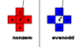

---
{
  "title": "SVG 填充规则",
  "datetime": "2024/07/06",
  "tags": [ "SVG" ]
}
---

# SVG 填充规则

填充规则: 当路径出现交叉, 每个区域根据一定的规则确定为**内部**或**外部**, 内部则填充, 外部则透明.

## nonzero

**非零规则**, 在需要判定的区域内任取一点, 任意选择一个方向绘制一条射线. 该射线与路径产生`n`个交点. 以射线方向为前,
对于每一个交点, 统计路径从左向右穿过射线的点数量为`a`, 从右向左穿过射线的点数量为`b`. 则该区域的值为`a - b`. 如果该值为
`0`, 则该区域为外部, 否则为内部.

## evenodd

**奇偶规则**, 在需要判定的区域内任取一点, 任意选择一个方向绘制一条射线. 该射线与路径产生`n`个交点. 如果交点数量为奇数,
则该区域为内部, 否则为外部.

## 示例

对形状 `M10,20 40,20 40,30 10,30Z M20,10 30,10 30,40 20,40Z`, 分析区域`3`的内外性.

### nonzero

射线与两段路径相交:

- 路径 `10,20 40,20` 从左向右穿过射线;
- 路径 `20,10 30,10` 从左向右穿过射线.

差值为`2`, 非零, 为内部.

### evenodd

射线与两段路径相交产生`2`个交点, 为偶数, 为外部.

## References

- [MDN - fill-rule](https://developer.mozilla.org/en-US/docs/Web/SVG/Attribute/fill-rule)
