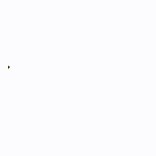

---
{
  "title": "SVG 路径动画",
  "datetime": "2024/11/04",
  "tags": [ "CSS", "SVG" ]
}
---

# SVG 路径动画

使用CSS动画可以简单地实现SVG路径的手绘效果(从头到尾逐渐显示).

## 效果



## 实现

- 使用 `SVGGeometryElement.getTotalLength` 方法获取路径的长度
- 调整 `stroke-dasharray` 属性实现动画

```html
<!doctype html>
<html lang="zh">
    <head>
        <meta charset="UTF-8">
        <meta name="viewport"
              content="width=device-width, user-scalable=no, initial-scale=1.0, maximum-scale=1.0, minimum-scale=1.0">
        <meta http-equiv="X-UA-Compatible" content="ie=edge">
        <title>SVG path handwriting</title>

        <style>
            @keyframes grow {
                0% {
                    stroke-dasharray: 0 var(--path-length);
                }
                100% {
                    stroke-dasharray: var(--path-length) 0;
                }
            }

            path {
                stroke: #303030;
                animation: grow 2s linear infinite;
            }
        </style>
    </head>
    <body>
        <svg width="100" height="100" viewBox="0 0 300 200" fill="none" xmlns="http://www.w3.org/2000/svg">
            <path id="path-el" d="M 0 100 L100 200 L300 0" stroke="black" stroke-width="5" fill="none"/>
        </svg>

        <script>
            /**
             * @type {SVGPathElement}
             */
            const el = document.getElementById('path-el');
            const pathLength = el.getTotalLength();
            el.style.setProperty('--path-length', pathLength);
        </script>
    </body>
</html>
```

## References

- [MDN -- stroke-dasharray](https://developer.mozilla.org/en-US/docs/Web/SVG/Attribute/stroke-dasharray)
