---
{
  "title": "第三方授权接入 (谷歌)",
  "datetime": "2024/12/29",
  "tags": [ "JavaScript" ]
}
---

# 第三方授权接入 (谷歌)

记录一下谷歌授权的接入, 包括前端和后端实现

## 前置

### 创建项目

在 Google Cloud 控制台中创建项目

1. 进入控制台
   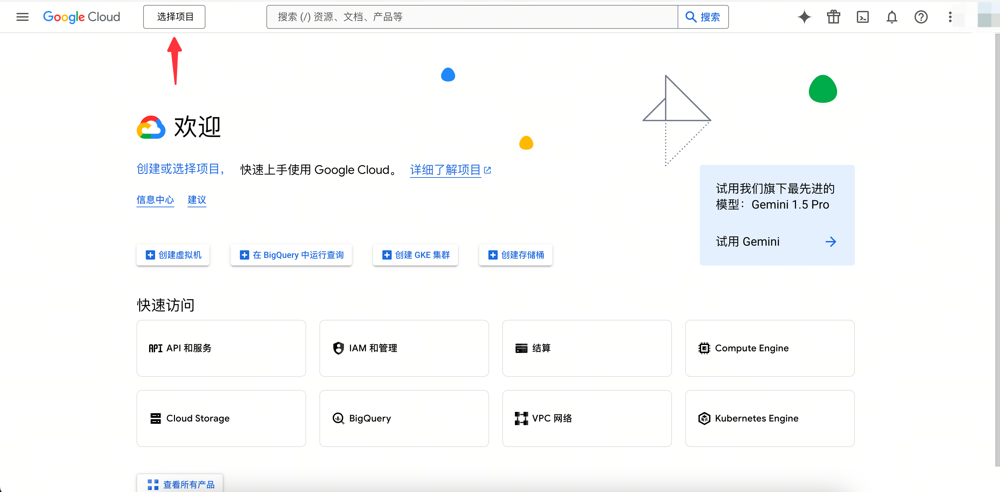

2. 新建项目
   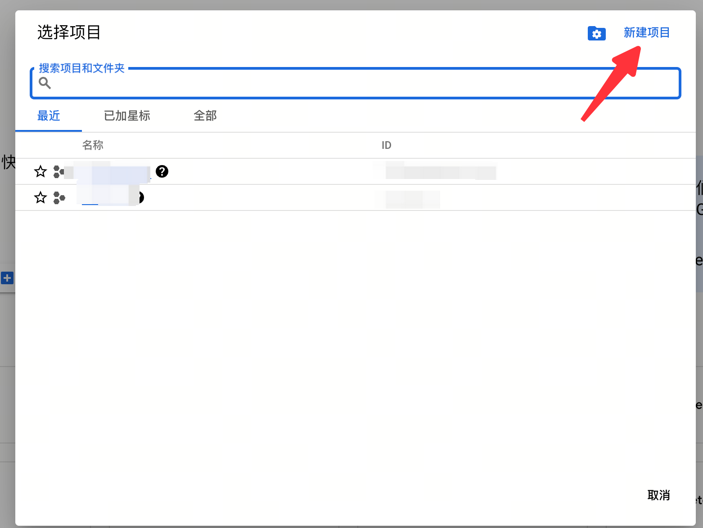
   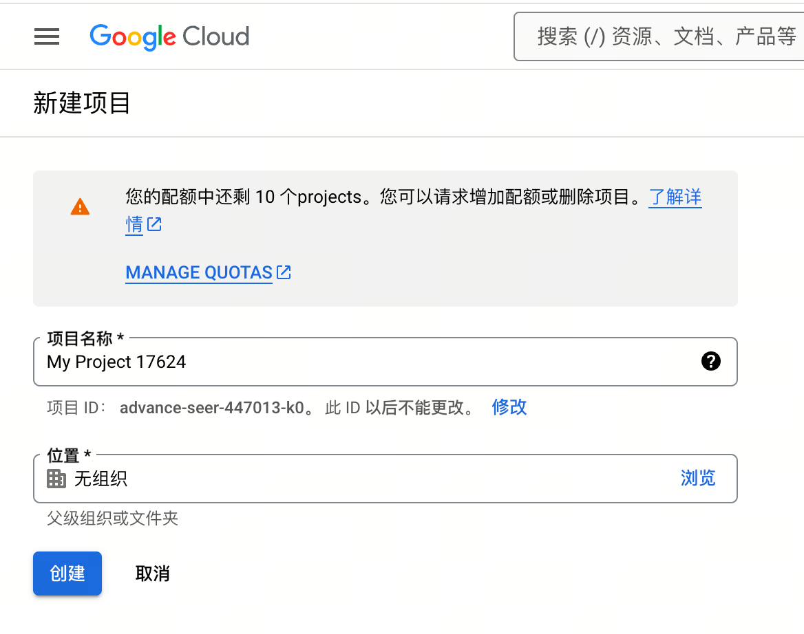

### 配置权限

1. 进入生成凭据页面
   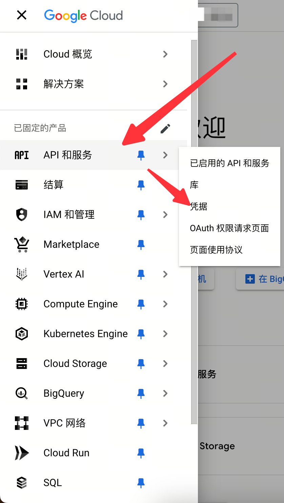

2. 初次进入需要先配置权限
   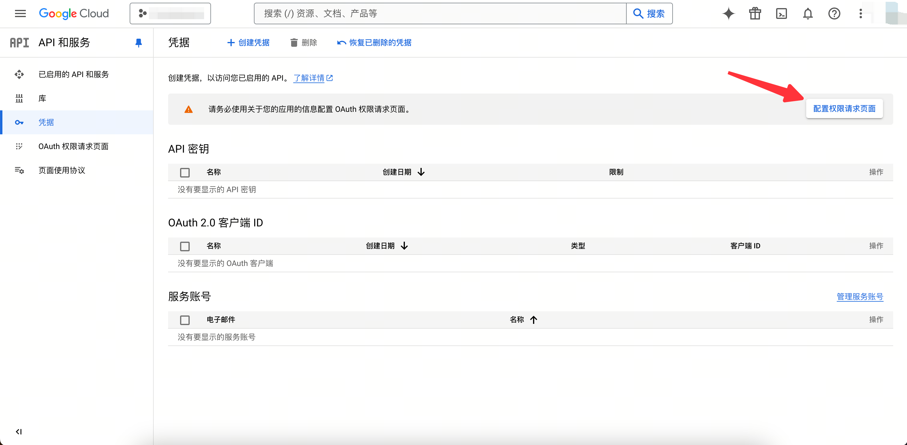

3. 设置用户类型
   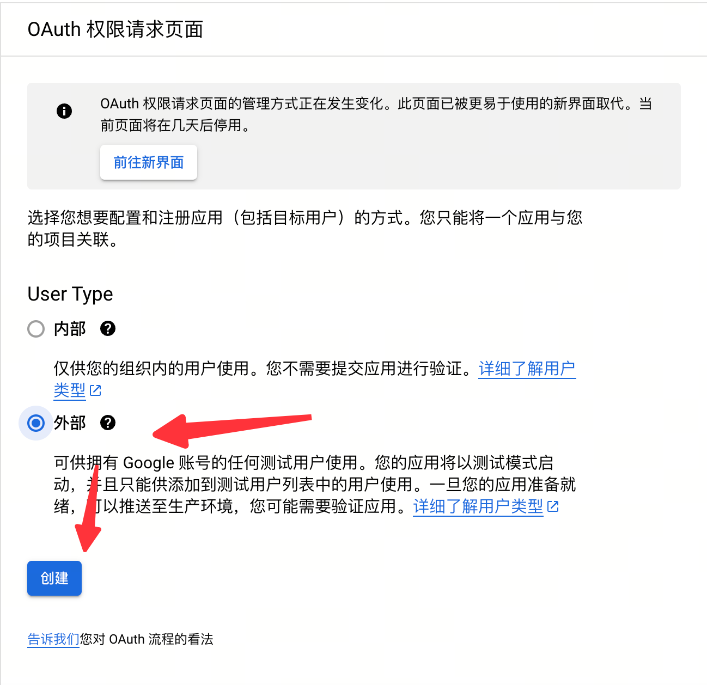

4. 设置 scope
   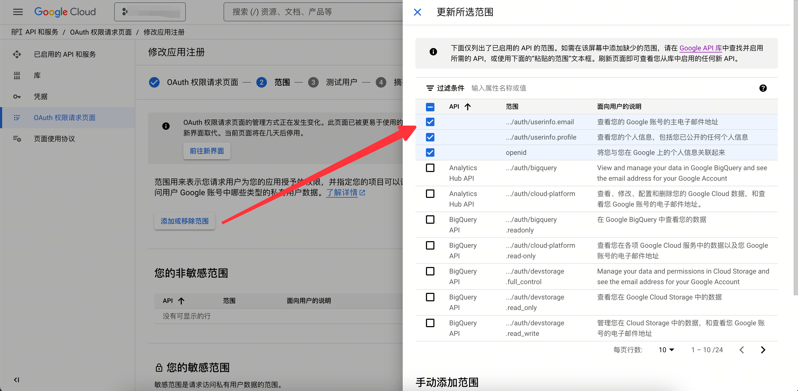

5. 查看已选择的 scope
   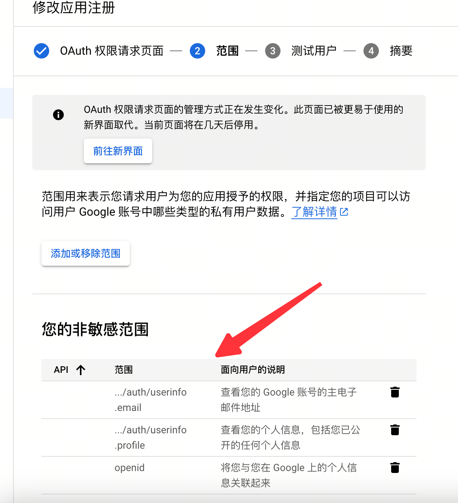

### 创建凭据

1. 生成 OAuth 2.0 ID
   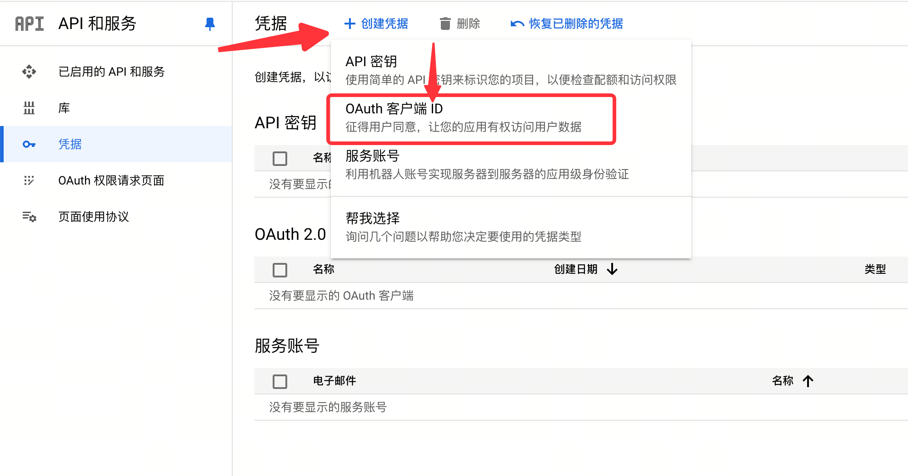

2. 选择应用类型, 此处选择 Web 应用
   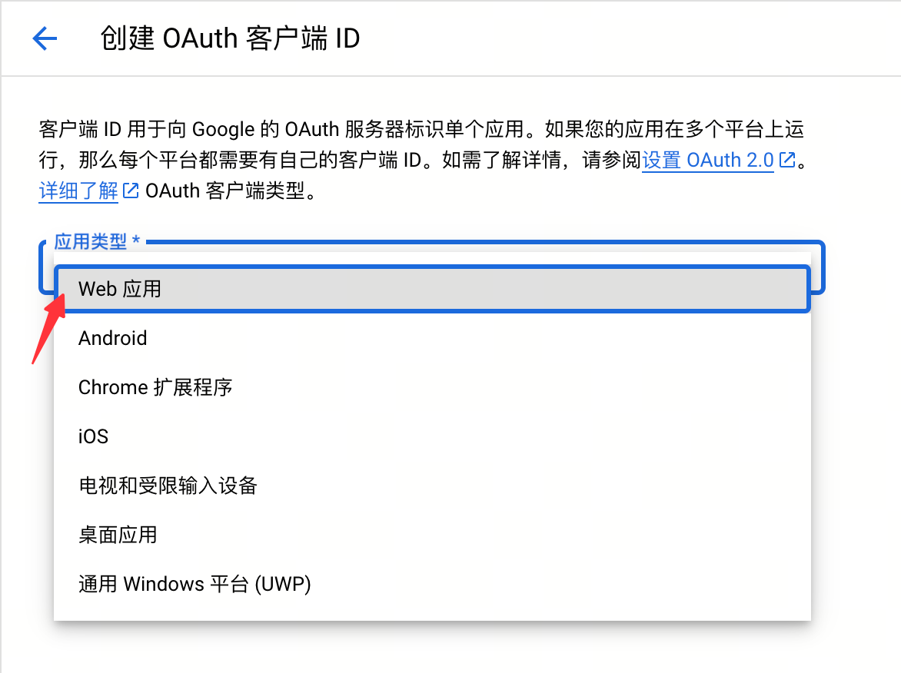

3. 配置谷歌登录来源和重定向目标
   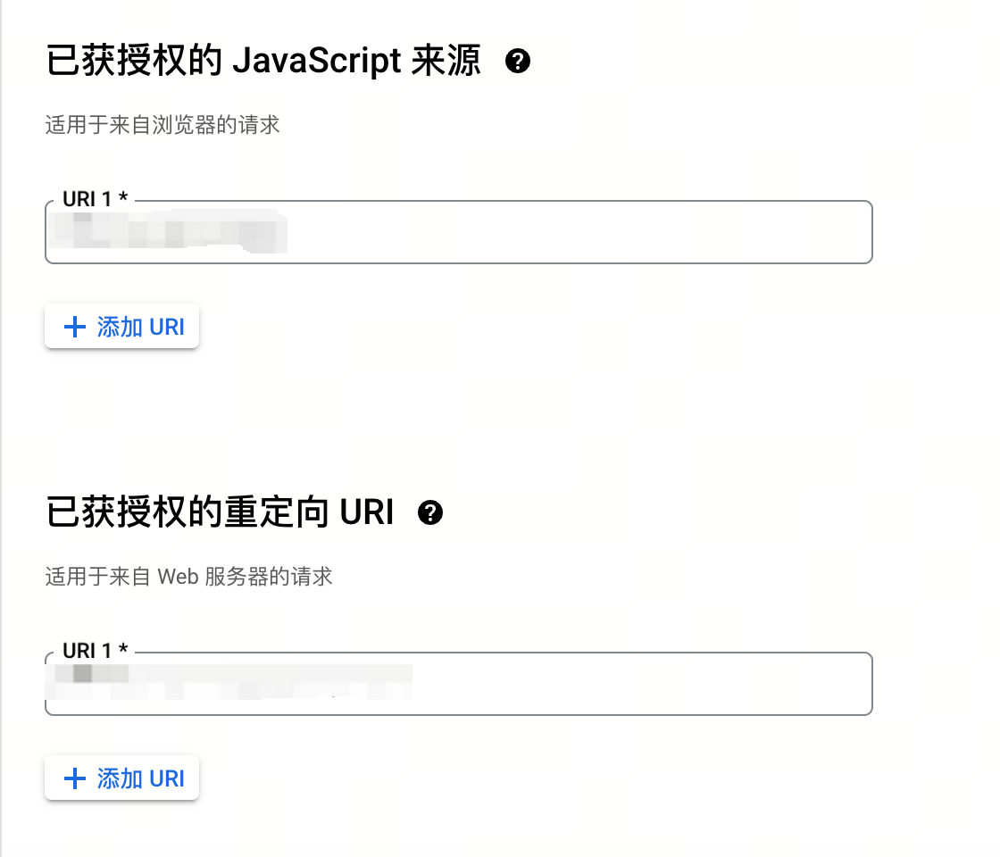

   > - "Javascript 来源" 为来源页面的 `window.origin`
   > - "重定向URI" 为授权后重定向的目标地址, 需要完全匹配

4. 创建完成
   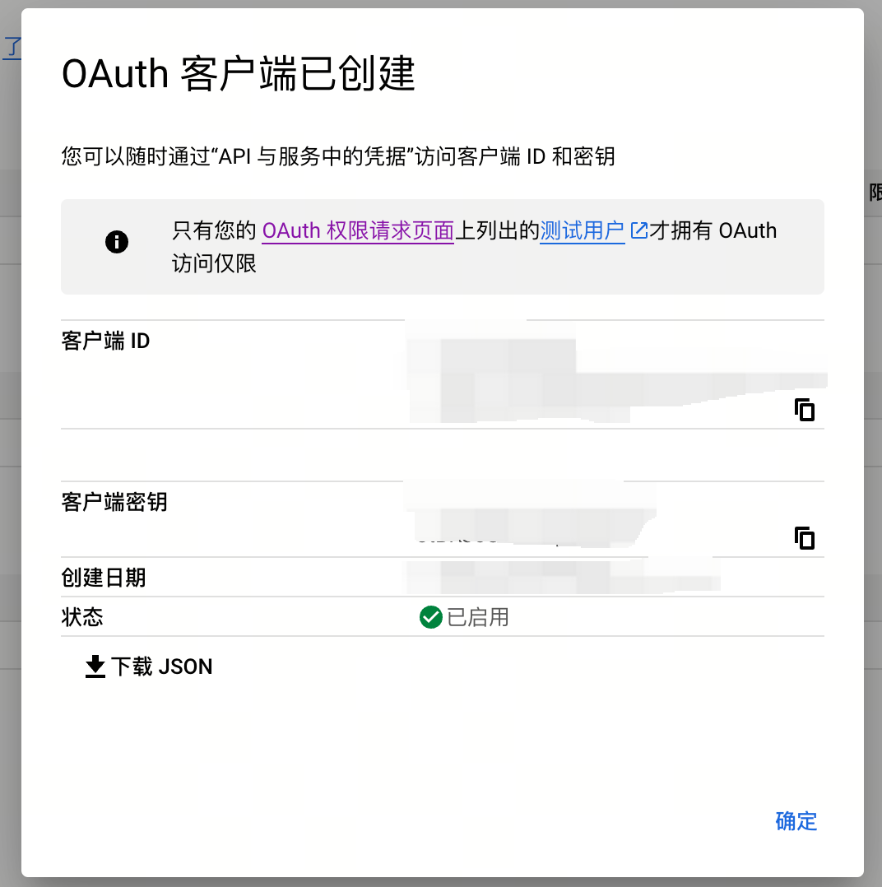

## 前端接入

此处使用的登录方式为设置 `redirect_uri` 为前端页面, 通过 Javascript 获取路由参数中携带的`code`进行自定义使用.
也可以将`redirect_uri`直接设置为后端接口地址, 通过`state`字段等方式实现将携带状态调用接口.

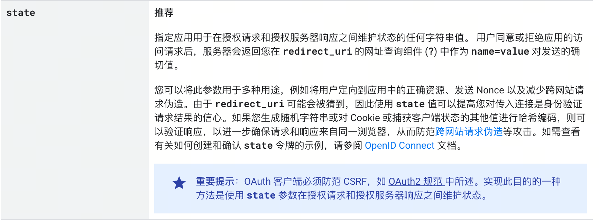

### 触发谷歌授权

```html
<!doctype html>
<html lang="zh">
    <head>
        <meta charset="UTF-8">
        <meta name="viewport"
              content="width=device-width, user-scalable=no, initial-scale=1.0, maximum-scale=1.0, minimum-scale=1.0">
        <meta http-equiv="X-UA-Compatible" content="ie=edge">
        <title>Document</title>
    </head>
    <body>
        <button id="btn">Google Auth</button>

        <script>
            const BASE_URL = 'https://accounts.google.com/o/oauth2/v2/auth'
            const CLIENT_ID = '<YOUR_CLIENT_ID>'

            const url = new URL(BASE_URL)
            url.searchParams.set('client_id', CLIENT_ID)
            url.searchParams.set('scope', 'https://www.googleapis.com/auth/userinfo.email https://www.googleapis.com/auth/userinfo.profile openid')
            url.searchParams.set('response_type', 'code')
            url.searchParams.set('include_granted_scopes', 'true')
            // 设置此参数才会每次都展示账号选择页面而非读取cookie直接授权
            url.searchParams.set('prompt', 'consent')
            // 默认是 online
            url.searchParams.set('access_type', 'offline')
            url.searchParams.set('redirect_uri', '<YOUR_REDIRECT_URI>')
            url.searchParams.set('state', '<YOUR_STATE>')

            window.btn.onclick = () => {
                window.open(url)
            }
        </script>
    </body>
</html>
```

### 获取授权code

谷歌授权页面会携带结果 `code` 前往 `redirect_uri` 地址, 在目标地址中可以使用 Javascript 从 URI 中提取 `code` 进行使用

```html
<!doctype html>
<html lang="zh">
    <head>
        <meta charset="UTF-8">
        <meta name="viewport"
              content="width=device-width, user-scalable=no, initial-scale=1.0, maximum-scale=1.0, minimum-scale=1.0">
        <meta http-equiv="X-UA-Compatible" content="ie=edge">
        <title>Google Auth Redirect Uri</title>
    </head>
    <body>
        <div id="box"></div>

        <script>
            const search = new URLSearchParams(window.location.search)
            const code = search.get('code')

            window.box.innerHTML = `Code is ${code}`
        </script>
    </body>
</html>
```

## 后端接入

后端主要分为两个步骤:

1. 使用授权代码换取刷新令牌和访问令牌
2. 使用访问令牌获取用户信息

### 使用授权代码换取刷新令牌和访问令牌

请求

```http request
POST /token HTTP/1.1
Host: oauth2.googleapis.com
Content-Type: application/x-www-form-urlencoded

code = <AUTH_CODE_FROM_FRONTEND> &
client_id = <YOUR_CLIENT_ID> &
client_secret = <YOUR_CLIENT_SECRET> &
redirect_uri = <YOUR_REDIRECT_URI> &
grant_type = authorization_code
```

响应

```typescript
type Response = {
    access_token: string
    expires_in: number
    refresh_token: string
    scope: string
    token_type: "Bearer",
    id_token: string
}
```

### 使用访问令牌获取用户信息

请求

```http request
GET /oauth2/v2/userinfo HTTP/1.1
Host: www.googleapis.com
Authorization: Bearer <ACCESS_TOKEN>
```

响应

```typescript
type Response = {
    id: string
    email: string
    verified_email: boolean
    name: string
    given_name: string
    family_name: string
    picture: string
}
```

### 代码实现

```rust
use serde::{Deserialize, Serialize};
use serde_json::Value;
use std::collections::HashMap;

#[derive(Serialize, Deserialize, Debug)]
pub struct GoogleUserInfo {
    pub id: String,
    pub email: String,
    pub verified_email: bool,
    pub name: String,
    pub given_name: String,
    pub family_name: String,
    pub picture: String,
}

struct GoogleRequest;

impl GoogleRequest {
    const CLIENT_ID: &'static str = "<YOUR_CLIENT_ID>";
    const CLIENT_SECRET: &'static str = "<YOUR_CLIENT_SECRET>";
    const GRANT_TYPE: &'static str = "authorization_code";
    const REDIRECT_URI: &'static str = "<YOUR_REDIRECT_URI>";

    #[inline]
    async fn get_access_token(code: &str) -> Result<String, String> {
        let client = reqwest::Client::new();
        let mut form = HashMap::new();
        form.insert("client_id", Self::CLIENT_ID);
        form.insert("client_secret", Self::CLIENT_SECRET);
        form.insert("grant_type", Self::GRANT_TYPE);
        form.insert("redirect_uri", Self::REDIRECT_URI);
        form.insert("code", code);

        match client
            .post("https://oauth2.googleapis.com/token")
            .form(&form)
            .send()
            .await
        {
            Ok(r) => match r.json::<Value>().await {
                Ok(obj) => {
                    if let Some(access_token) = obj.get("access_token") {
                        match access_token.as_str() {
                            Some(access_token) => Ok(access_token.to_string()),
                            None => Err("Not a string".to_string()),
                        }
                    } else {
                        Err("No access_token".to_string())
                    }
                }
                Err(err) => Err(format!("{}", err)),
            },
            Err(err) => Err(format!("{}", err)),
        }
    }

    #[inline]
    async fn get_userinfo(token: &str) -> Result<GoogleUserInfo, String> {
        let client = reqwest::Client::new();
        match client
            .get("https://www.googleapis.com/oauth2/v2/userinfo")
            .header("Authorization", format!("Bearer {}", token))
            .send()
            .await
        {
            Ok(r) => r
                .json::<GoogleUserInfo>()
                .await
                .map_err(|err| format!("{}", err)),
            Err(err) => Err(format!("{}", err)),
        }
    }

    pub async fn get_user_info_from_code(code: &str) -> Result<GoogleUserInfo, String> {
        let token = Self::get_access_token(code).await?;
        Self::get_userinfo(&token).await
    }
}
```

## Reference

- [Google cloud 控制台](https://console.cloud.google.com/)
- [获取 OAuth 2.0 访问令牌](https://developers.google.com/identity/protocols/oauth2/web-server?hl=zh-cn#obtainingaccesstokens)
- [使用授权代码换取刷新令牌和访问令牌](https://developers.google.com/identity/protocols/oauth2/web-server?hl=zh-cn#exchange-authorization-code)
